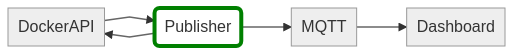

# Architecture

## Purpose
The Publisher component listens for events on the Docker API. These events are published to an MQTT endpoint.
The Docker events contain only basic information about the container involved in the event. In order to retrieve all container information the 
publisher also inspects the containers upon an event that involves the container. The data retrieved from a container inspection is also published on an MQTT topic.

## Features

- Publish Docker events to an MQTT endpoint
- Publish `docker inspect` information of every container to an MQTT endpoint
- Publish system information to an MQTT endpoint

## MQTT

### Subscriptions

This component doesn't subscribe to MQTT topics.

### Publications

All topics are prefixed with the value from the TOPIC_NS (topic namespace) environment variable. The idea is that in a Swarm environment multiple 
publishers will be used. Each publisher can then publish information on separate topics.

 - TOPIC_NS + /info
   
    Publishes system information once when the publisher is started.
    See the Display System Wide Information section of the [Docker API Documentation](https://docs.docker.com/engine/api/v1.23/#23-misc).

 * TOPIC_NS + /event

    Publishes event information. See the Monitoring Docker's Events section of the [Docker API Documentation](https://docs.docker.com/engine/api/v1.23/#23-misc)
 
 * /container/info 
 
    Publishes the information obtained from a `docker inspect` operation on a specific container. See the Inspect a Container section of the [Docker API Documentation](https://docs.docker.com/engine/api/v1.23/#21-containers)

## Deployment considerations

This component needs access to the Docker Daemon API. Normally this API is exposed locally on the machine where Docker runs as a file socket on `/var/run/docker.sock`. Therefore it is natural to deploy the publisher on the machine where Docker runs. This also eliminates any latency that could impact the event subscription.